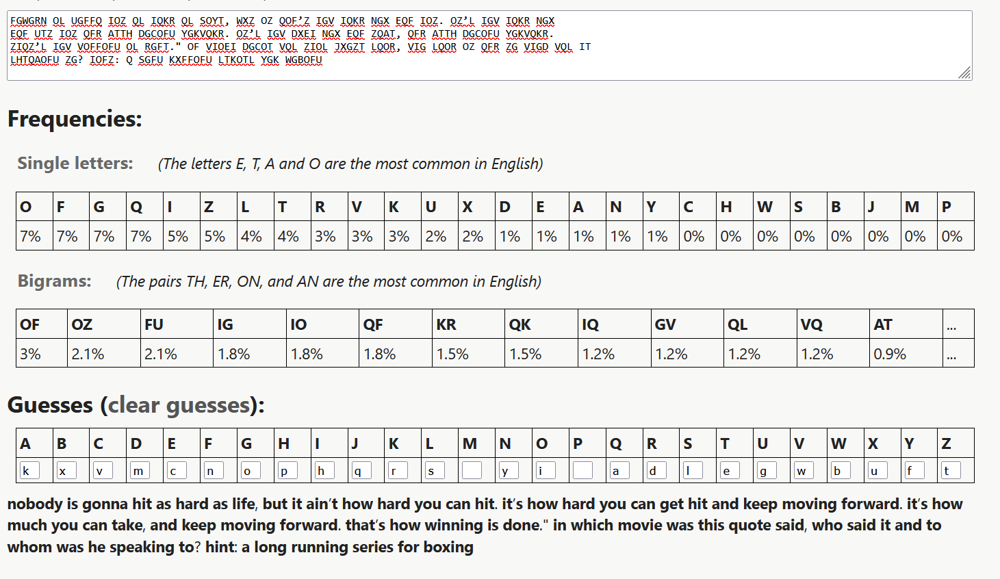

## Question 1: What is the decrypted message?

Answer: nobody is gonna hit as hard as life, but it ain’t how hard you can hit. it’s how hard you can get hit and keep moving forward. it’s how much you can take, and keep moving forward. that’s how winning is done." in which movie was this quote said, who said it and to whom was he speaking to? hint: a long running series for boxing

## Question 2: What do you think are the most common letters in the above cipher? Is it different from the most common letter in the english language?

Answer: The most common letters in cipher are O,F,G,Q all with around 7% occurances. The most common letters in english language are E,T,A and O so yes they are different. 

## Question 3: What do you think are the least common letters in the above cipher? Is it different from the least common letter in english language?

Answer: The least common letters in the cipher are B,J,M and P all with around 0% occurances. The least common letters in english are Z,Q and X.

## Question 4: What are the answers to the questions in the decrypted message?

Answer: The quote was said in Rocky Balboa (2006). The quote was said by Rocky to his son.

## Question 5: How long did it take you to crack the cipher? Do you think this is a secure approach to encrypting messages?

Answer: Manual approach took around 10mins or so because the initial guessing took some time, once a few words made sense after that it is quite easy to break the cipher. If done by a script it would also not take much time since we can brute force for every possible letter and list them out easily.

